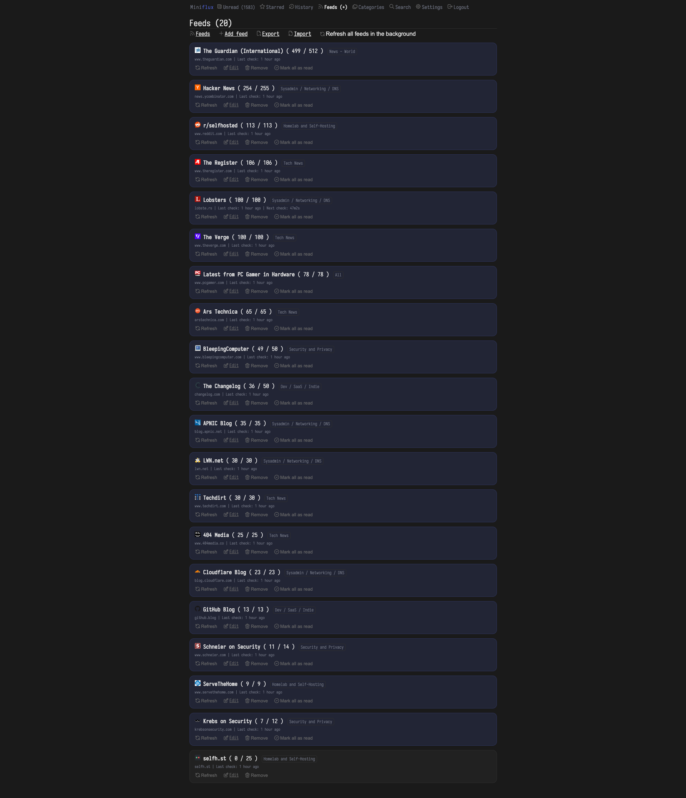

# miniflux-selfhst-theme

A dark theme (custom CSS) for [Miniflux v2](https://github.com/miniflux/v2), based loosely on the current design of the [selfh.st](https://selfh.st) website: bright letters on a near-black background, blue accents, rounded cards, pill buttons, and 20px left/right page gutters — all set in [Iosevka](https://typeof.net/Iosevka/).



## Usage

1. In Miniflux, go to **Settings** and set **Theme** to *Dark - Sans serif* (recommended base).
2. Set **External font hosts** to `cdn.jsdelivr.net` so the Iosevka webfont can load — see [Fonts](#fonts). (Without it nothing breaks; the theme falls back to your system monospace font.)
3. Copy the contents of [miniflux-selfhst-dark.css](miniflux-selfhst-dark.css) into **Settings → Custom CSS**.
4. Save and reload.

## What it changes

- Sets [Iosevka](https://typeof.net/Iosevka/) as the typeface for the UI and article text, loaded as a webfont (regular, italic, semibold, bold) from jsDelivr via [Fontsource](https://fontsource.org/fonts/iosevka)
- Dark `#1a1a1a` background with bright `#e6e6e6` text; secondary text in `#6e7281`, icons in `#676767`, and read items dim to gray
- Blue `#4c60d0` accents for hovers, primary buttons, the keyboard-navigation highlight, in-article links, and blockquote bars
- Article list items become solid `#212121` rounded cards instead of dotted outlines; buttons are pill-shaped; inputs get rounded corners and a soft blue focus ring
- 20px left/right page gutters on `<body>`, with the padding on `main` (and Miniflux's other stock offsets) removed so edges align
- Overrides every theme variable from Miniflux's `dark.css`, plus the colors hardcoded in `common.css` for the light theme (item-meta hover, entry title hover, `#ddd` borders, etc.), so it renders correctly on top of any base theme

The whole palette is defined once as `--sh-*` custom properties at the top of the file, so recoloring the theme means editing those few lines. Built against the Miniflux v2 stylesheets (`common.css` + `dark.css`) as of June 2026.

## Palette

| Role | Color |
| --- | --- |
| Page background | `#1a1a1a` |
| Cards / panels / inputs | `#212121` |
| Primary text | `#e6e6e6` |
| Secondary text | `#6e7281` |
| Icons | `#676767` |
| Accent (links, buttons, highlights) | `#4c60d0` |
| Hairlines / borders | `#2e2e2e` |

## Fonts

The theme loads Iosevka as an external webfont: the four `@import` lines at the very top of the CSS pull the [Fontsource](https://fontsource.org/fonts/iosevka) build from jsDelivr, and `--font-family` points at it. The files are subset per script and per weight, so the browser only downloads the styles a page actually uses.

### How external fonts work in Miniflux

Miniflux 2.2.2+ can load fonts from the web: in **Settings**, set **External font hosts** to a space-separated list of hostnames (no `https://`, no paths). Miniflux adds them to its Content-Security-Policy — `font-src` for the font files, plus `style-src` so stylesheet imports work. With the field empty, the CSP allows no font sources at all: the theme's `@import` lines are silently blocked and the font stack falls back to your system monospace font. For this theme the field just needs:

```
cdn.jsdelivr.net
```

### Using a different font

- **Another hosted font.** Replace the `@import` lines with your font's stylesheet and update `--font-family`. `@import` is only valid before all other rules, so keep them at the very top. For Google Fonts, allow `fonts.googleapis.com fonts.gstatic.com` and use e.g.:

  ```css
  @import url("https://fonts.googleapis.com/css2?family=JetBrains+Mono:ital,wght@0,400;0,600;0,700;1,400&display=swap");
  ```

  [Bunny Fonts](https://fonts.bunny.net) works the same way and serves everything from the single host `fonts.bunny.net`.

- **A locally-installed font**, e.g. a Nerd Font — the icon-patched builds aren't hosted on any webfont CDN, but they don't need to be: install the font on the devices you read Miniflux from, delete the `@import` lines, and put the family name first in `--font-family`, exactly as your OS lists it (the "Mono" variants keep icon glyphs at single-cell width):

  ```css
  --font-family: "Iosevka Nerd Font Mono", ui-monospace, monospace;
  ```

  `--entry-content-font-family` and `--entry-content-quote-font-family` follow `--font-family`, so article text picks it up too. Devices without the font fall back to the next one in the list.

- **Self-hosted.** Upload a `.woff2` to any host you control (your Miniflux domain works too, but it still has to be listed — the default is to block everything), add that hostname to **External font hosts**, and declare the font anywhere in the custom CSS:

  ```css
  @font-face {
      font-family: "JetBrainsMono Nerd Font Mono";
      src: url("https://files.example.com/fonts/JetBrainsMonoNerdFontMono-Regular.woff2") format("woff2");
      font-weight: 400;
      font-style: normal;
  }
  ```

## Credits

The look is loosely modeled on [selfh.st](https://selfh.st), Ethan Sholly's self-hosted news site and newsletter:


- [Iosevka](https://typeof.net/Iosevka/) — the theme's typeface, by Renzhi Li (be5invis), SIL Open Font License 1.1
- [Fontsource](https://fontsource.org/fonts/iosevka) and [jsDelivr](https://www.jsdelivr.com/) — the webfont package and the free CDN that serves it
- [JetBrains Mono](https://www.jetbrains.com/lp/mono/) — by JetBrains, SIL Open Font License 1.1; used in the font-swap examples
- [Nerd Fonts](https://www.nerdfonts.com/) — Ryan L McIntyre's icon-patched font builds, the locally-installed option
- [Miniflux](https://miniflux.app/) — the minimalist feed reader this theme dresses up

## License

[MIT](LICENSE)
